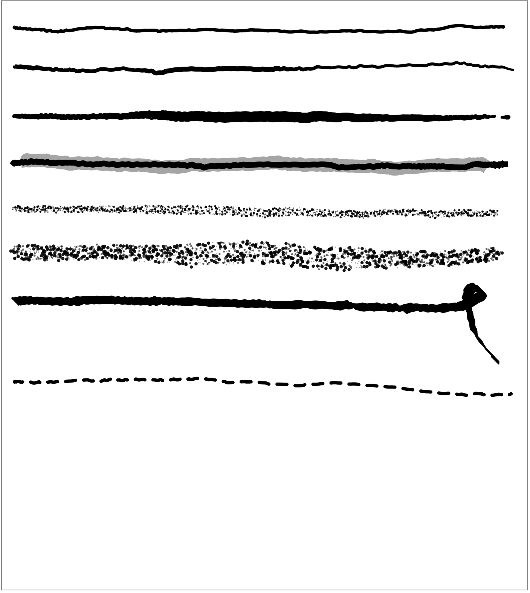
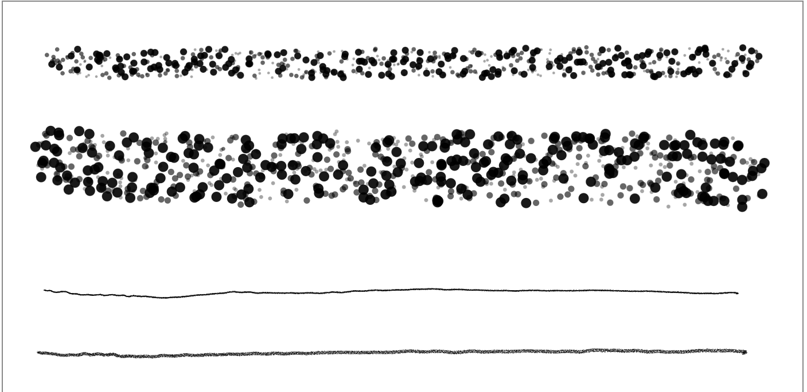

# Conformance report — Wacom Movink Pad 11 (MIP11), Phase 3

| | |
|---|---|
| **Device** | Wacom Movink Pad 11 — `DTHA116`, serial `5HL21V5007384` |
| **Android** | 14 (API 34) |
| **Library** | sprout-canvas `0.1.0-SNAPSHOT` |
| **Phase** | 3 — tooling & rendering fidelity |
| **Date** | 2026-08-08 |
| **Engine selected** | `generic` (software) — no vendor adapters exist yet |
| **Input** | **The real Wacom pen, in a human hand.** Not `adb shell input stylus`. |

The Phase 2 run on this device (`mip11-2026-08-08.md`) covered capture, bounds, exclusion, ingest
and resize. This one covers the thing Phase 2 could only assert indirectly: **what the nine pens
actually look like**, drawn by hand, at both ends of the width ladder.

---

## Why this run needed a person

Every automated result in the Phase 2 report carries the same caveat: `adb shell input stylus`
events come from a virtual input device that declares no motion axes, so they carry `TIMESTAMP`
only. The pressure-sensitive pens fall back to their velocity curve and an `adb` swipe is fast, so
`FOUNTAIN` and `BRUSH` render thin and even — the two pens whose entire point is that they do not.

So the acceptance criterion *"pressure genuinely modulates `FOUNTAIN`/`BRUSH` width on a device that
reports pressure"* is not automatable on any device, and this is the run that answers it.

> The tester has a brain tremor, so the strokes below wobble. That is the hand, not the renderer —
> and it is arguably a better test than a ruler-straight line, because a renderer that only looks
> right on smooth input is a renderer that looks wrong on real handwriting.

---

## The nine pens, one stroke each, 5 dp black

Top to bottom: **Ballpoint · Fountain · Brush · Marker (with Highlighter drawn across it) · Pencil ·
Charcoal · Calligraphy · Dashed.**

| Acceptance criterion (PLAN.md §7, Phase 3) | Result |
|---|---|
| All nine pens visually distinct and recognizable as what their name claims | ✅ |
| `MARKER` and `HIGHLIGHTER` are unmistakably different tools | ✅ opaque black band vs. translucent grey wash, both legible where they overlap |
| Pressure genuinely modulates `FOUNTAIN`/`BRUSH` width | ✅ but subtly — see below |
| `CALLIGRAPHY` produces a real chisel nib | ✅ **the clearest result on the sheet** |
| `PENCIL`/`CHARCOAL` show actual grain at reasonable widths | ✅ at 5 dp — fine vs. coarse, correctly ordered |
| Ingest round-trip pixel-identical for every pen | ✅ automated, all nine (`CanvasInstrumentedTest`) |

**On the calligraphy stroke.** The tester added a descending curl at the end of it, on the reasoning
that a nib has to be proven in *both* directions. It is the single most informative mark in this
report: the horizontal run is thick, the descender is thin, and the transition between them happens
where the stroke crosses the nib angle. That is a chisel, not a round pen wearing a chisel's name.

**On pressure.** Fountain tapers in and out at both ends and brush varies visibly through the
stroke, so the pressure path is live and the criterion passes. But at 5 dp the fountain is only just
distinguishable from the ballpoint at a glance. Recorded as tuning input for Phase 4/5, not fixed
here — see the note at the end.

---

## Texture pens at both ends of the width ladder

Pencil and charcoal, at **12 dp** (top two) and **0.5 dp** (bottom two):

This pass exists because the golden suite grew width ladders in this phase and immediately showed
something the single-width scenes could not. Hardware confirms it, and adds a second finding.

**Finding 1 — the grain becomes discrete circles at the top of the ladder.**
At 12 dp the charcoal is a dense field of individually resolvable dots, and the pencil is a scatter
of separate specks. Neither reads as graphite or charcoal; they read as speckle. This is precisely
the failure `PenTuning.grainScale` was introduced in Phase 2 to prevent — *"at five times the width
the stamps become a row of distinct circles rather than texture"* — and it shows that the fix holds
in the middle of the ladder and stops holding at the top of it. Stamp size scales linearly with
drawn width with no ceiling.

**Finding 2 — pencil and charcoal swap character at the bottom of the ladder.**
At 0.5 dp the **pencil** draws a clean line with essentially no grain, while the **charcoal** draws a
finely textured one. That is backwards: charcoal is supposed to be the coarser of the two. The cause
is arithmetic rather than mysterious — at HAIRLINE the pencil's ×2 multiplier leaves ~2 px of drawn
width, which has no room for grain at all, while charcoal's ×5 leaves ~5 px, which just barely does.
So the two pens cross over somewhere near the bottom of the ladder.

Both findings are now pinned by goldens (`width-pencil-*`, `width-charcoal-*`), so whichever way
they are eventually tuned, the change will be visible in a diff.

**Finding 3 — texture pens "pull" at the start of a stroke.** Reported by the tester, unprompted:
pencil and charcoal lag the pen for the first moment of a stroke and then keep up normally. Not
reproducible in any offline tier — a golden renders a finished stroke and says nothing about the
rate at which it appeared. It belongs with the deferred performance-benchmark work (PLAN.md §9);
the texture renderer places far more primitives per unit length than any other, so a first-stroke
cost there is plausible rather than surprising.

---

## Automated tiers, this phase

| Tier | Result |
|---|---|
| JVM (`./gradlew build test`) | ✅ green |
| Golden suite (`./gradlew goldenTest`) | ✅ **33 scenes**, up from 18 |
| Committed-layer path agreement | ✅ new assertion, both tiers |

The golden suite gained fifteen scenes and one corrected one:

- **Width ladders** — `width-{pencil,charcoal}-{hairline,bold,xxl}` and
  `width-{ballpoint,marker,calligraphy}-{hairline,xxl}`. These are what produced findings 1 and 2.
- **`highlighter-over-ink`, corrected.** It had drawn a highlighter onto a blank bitmap since Phase
  2 — a scene named for a blend it never performed. Scenes now hold a *list* of strokes, so it
  draws ink first and washes over it, and `highlighter-host-alpha` covers the neighbouring rule that
  an app supplying its own alpha overrides the pen's default.
- **`committed-page` and `committed-highlighter-over-ink`** render through `CommittedLayer`'s
  software branch — the branch an Onyx panel repaint and any host screenshot take, which had no
  pixel coverage at all. Both tiers now also assert that the committed path and the direct path
  produce byte-identical bitmaps, so losing that branch fails a test instead of silently blanking
  every e-ink repaint in Phase 4.

---

## Deliberately not done in this phase

**The pen curves were not tuned.** PLAN.md §7 Phase 3 defers this to Phase 4/5 on the reasoning that
the software renderer is currently the only reference in existence, so tuning it now means tuning
against preference alone — and worse, means the vendor paths would later be tuned to agree with a
reference nobody had checked against real firmware ink. Findings 1 and 2 above are exactly the
material that pass should start from, which is why they are recorded with pictures rather than
fixed in passing.

**`GenericPenTable` still reports `NATIVE` for all nine pens**, re-examined and left unchanged on
purpose. `PenFidelity` describes how faithfully *an engine* reproduces a pen, not how good the ink
looks; on an ordinary tablet there is no other path for the software renderer to be worse than. The
reasoning and what would overturn it are recorded in the table's own KDoc.
